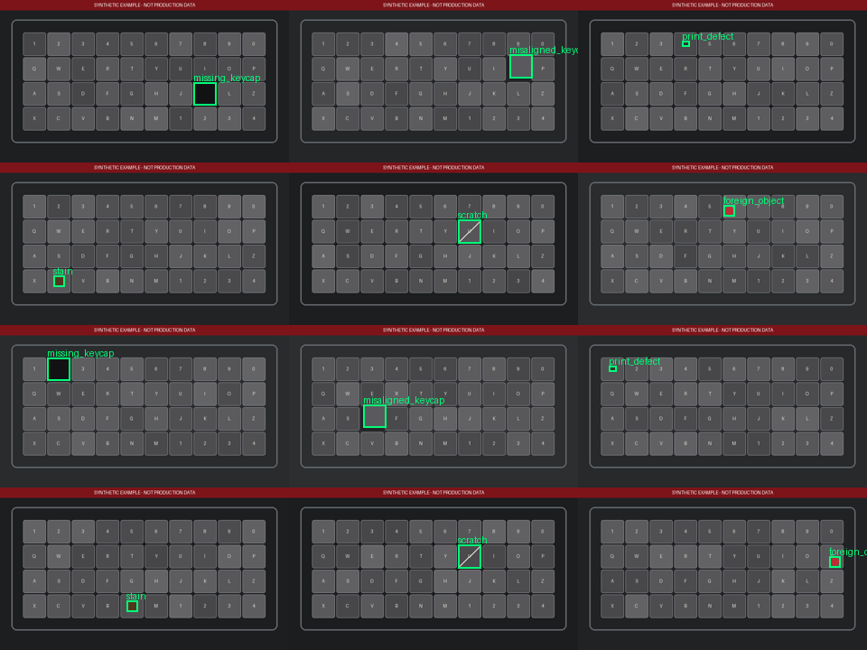
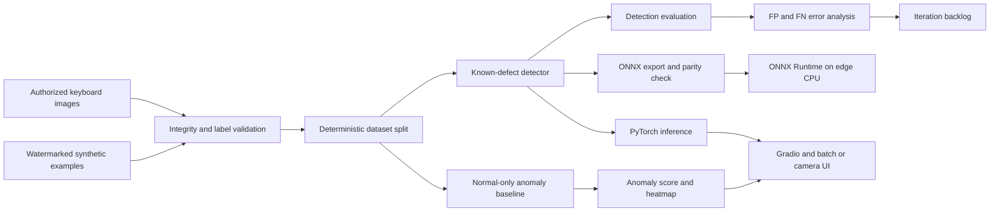
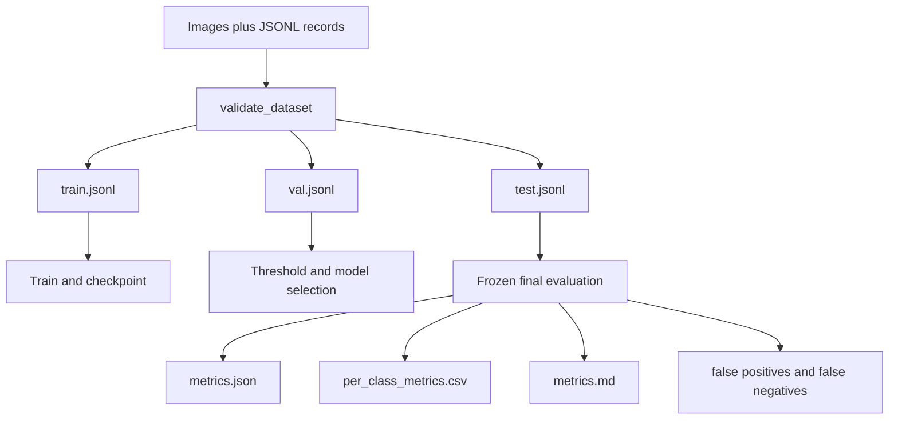

# KeyVision-QA

**Industrial keyboard defect inspection, unknown-anomaly localization, error analysis, and
ONNX edge deployment in one reproducible computer-vision project.**

[](https://github.com/LshWilliam/keyvision-qa/actions/workflows/ci.yml)
[](https://www.python.org/)
[](LICENSE)

> **Result integrity:** this repository contains no private production data and makes no
> production-performance claim. The included images are programmatically generated and visibly
> marked **SYNTHETIC EXAMPLE**. The checked-in result summary, once present, comes from an actual
> local smoke run and does not measure real industrial accuracy.

## One-minute overview

| Question | Answer |
| --- | --- |
| What problem? | Find known keyboard defects while also localizing novel visual anomalies. |
| What methods? | Torchvision Faster R-CNN adapter, export-friendly tiny smoke detector, and a fixture-aligned Gaussian anomaly template. |
| What results? | Real-data training has **not** been run. Local synthetic smoke results are reported only after execution. |
| How do I run it? | `pip install -e ".[dev,demo,deploy]"`, then `python scripts/smoke_test.py` or `python app.py`. |
| Engineering highlights? | Typed configuration, deterministic data pipeline, resumable training, transparent detection metrics, FP/FN mining, ONNX parity checks, Gradio, tests, CI, and Docker. |



*The contact sheet above is synthetic and watermarked. It is a pipeline example, not factory data.*

## Background and business problem

Manual keyboard inspection is repetitive and sensitive to fatigue, lighting, viewpoint, and the
small physical size of print or scratch defects. A fixed defect taxonomy helps when failure modes
are known, but manufacturing lines also encounter previously unseen debris, material variation,
or assembly failures. A useful inspection service therefore needs two complementary decisions:

1. **Known-defect detection** gives localized, named, confidence-scored findings that map directly
   to quality rules and root-cause dashboards.
2. **Unknown-anomaly detection** learns normal appearance and produces a score plus heatmap without
   requiring labels for every future defect.

KeyVision-QA demonstrates both paths and the engineering around them: dataset contracts, training,
evaluation, error analysis, export, parity validation, batch/camera inference, and a local UI.

## Core features

- Portable JSONL dataset format with image integrity, dimension, box-boundary, category, and
  duplicate checks.
- Reproducible class-aware train/validation/test splitting and dataset statistics.
- Clearly watermarked synthetic generator for pipeline tests—not model claims.
- Unified detector interface with:
  - **Faster R-CNN MobileNetV3 FPN**, the production-oriented known-defect candidate.
  - **Tiny single-defect CNN**, used only for fast CI, ONNX, and end-to-end smoke tests.
- Resumable checkpoints, best/last checkpoint saving, fixed seeds, typed YAML configuration, and
  captured environment/run metadata.
- Fixture-aligned Gaussian normal template with anomaly score and pixel heatmap.
- Precision, recall, F1, AP@50, AP@50:95, per-class PR data, confusion matrix, latency, FPS,
  parameter count, and file-size utilities.
- JSON, CSV, and Markdown result export plus confidence-sorted FP/FN artifacts.
- Native PyTorch and ONNX Runtime inference, numerical parity verification, image/folder/camera
  entry points, Gradio demo, Dockerfile, pytest, Ruff, mypy, and GitHub Actions.

## System architecture



### Data flow



## Model design

### Known defects

`TorchvisionFasterRCNNDetector` adapts Faster R-CNN with a MobileNetV3 FPN backbone and replaces its
classification head for six keyboard defect classes. It accepts variable numbers of targets and
returns a backend-neutral structure. Transfer learning is configurable; disabling pretrained
weights avoids an implicit network download.

The `TinyDefectDetector` predicts at most one defect per image. That limitation is intentional: it
makes a complete train-to-ONNX path fast enough for CI. It is **not** presented as the accuracy
baseline for deployment.

### Unknown anomalies

`GaussianTemplateAnomalyDetector` fits pixel-position RGB and local-gradient mean/standard
deviation from aligned normal images. A robust high quantile of the standardized residual becomes
the image score; residual magnitude becomes the heatmap. The design is interpretable and has no
external weight download, but it depends on a stable camera fixture and registration.

### Why both branches?

| Known-defect detection | Unknown-anomaly detection |
| --- | --- |
| Requires labeled defect boxes | Requires normal images |
| Names and localizes trained classes | Flags deviations from normal appearance |
| Supports class-specific quality rules | Covers novel defects but cannot name root cause |
| Can miss unseen failure modes | Can overreact to harmless pose or lighting change |

Production policy should combine calibrated branch scores, business costs, and an operator review
queue rather than treating either model as universally sufficient.

## Installation

Python 3.10 or newer is required.

```bash
git clone https://github.com/LshWilliam/keyvision-qa.git
cd keyvision-qa
python -m venv .venv
# Windows: .venv\Scripts\activate
# Linux/macOS: source .venv/bin/activate
python -m pip install --upgrade pip
python -m pip install -e ".[dev,demo,deploy,vision]"
```

PyTorch accelerator packages are platform-specific. The command above installs the resolver's
default build. Follow the official PyTorch selector when CUDA execution is required, then confirm
with:

```bash
python -c "import torch; print(torch.__version__, torch.cuda.is_available())"
```

## Quick start: honest synthetic smoke test

```bash
python scripts/smoke_test.py
```

This command generates watermarked examples, validates labels, trains the tiny model for one epoch,
runs image and anomaly inference, exports ONNX, checks PyTorch/ONNX output parity, and writes
`artifacts/smoke_report.json`. Artifacts and checkpoints are intentionally ignored by Git.

Individual steps:

```bash
python -m keyvision.data.synthetic --output artifacts/synthetic --count 42
python -m keyvision.data.validation --root artifacts/synthetic --manifest artifacts/synthetic/manifest.jsonl
python -m keyvision.data.stats --manifest artifacts/synthetic/manifest.jsonl
python -m keyvision.data.visualize --root artifacts/synthetic --manifest artifacts/synthetic/manifest.jsonl --output assets/synthetic_contact_sheet.png
python -m keyvision.training.train --config configs/smoke.yaml
python -m keyvision.evaluation.cli --config configs/smoke.yaml --checkpoint artifacts/runs/smoke/best.pt
```

## Prepare an authorized dataset

Each UTF-8 JSONL line uses relative paths and COCO-style absolute `xywh` boxes:

```json
{"image":"images/sample.png","width":1280,"height":720,"annotations":[{"bbox":[100,120,30,24],"category_id":0,"category":"missing_keycap"}],"synthetic":false}
```

Keep raw data under ignored `data/raw/` or another non-repository path, then set `data.root` and
manifest paths in a new YAML file. Never commit company imagery or data without explicit authority.
See [data/README.md](data/README.md) and [DATASET_CARD.md](DATASET_CARD.md).

## Train, validate, and test

```bash
python -m keyvision.training.train --config configs/default.yaml
python -m keyvision.evaluation.cli --config configs/default.yaml --checkpoint artifacts/runs/fasterrcnn/best.pt --split val
python -m keyvision.evaluation.cli --config configs/default.yaml --checkpoint artifacts/runs/fasterrcnn/best.pt --split test
```

Set `training.resume` to `artifacts/runs/fasterrcnn/last.pt` to continue an interrupted run. The
exact configuration and environment are stored with the run summary. Select thresholds on
validation data only; reserve test data for a frozen final evaluation.

## Inference

Single image or folder:

```bash
python -m keyvision.inference.cli --config configs/smoke.yaml --checkpoint artifacts/runs/smoke/best.pt --input artifacts/synthetic/images/keyboard_0000.png --output artifacts/predictions
python -m keyvision.inference.cli --config configs/smoke.yaml --checkpoint artifacts/runs/smoke/best.pt --input artifacts/synthetic/images --output artifacts/batch_predictions
```

Local camera:

```bash
python -m keyvision.inference.cli --config configs/smoke.yaml --checkpoint artifacts/runs/smoke/best.pt --webcam
```

Camera inference requires the `vision` extra and an available local camera. Press `q` to exit.

## Gradio demo

```bash
# Optional: point the demo to a real local checkpoint.
# Windows PowerShell: $env:KEYVISION_CHECKPOINT="artifacts/runs/smoke/best.pt"
# Linux/macOS: export KEYVISION_CHECKPOINT="artifacts/runs/smoke/best.pt"
python app.py
```

The UI supports uploads and webcam frames, switches between known-defect boxes and unknown-anomaly
heatmaps, and displays latency and inference metadata. Without `KEYVISION_CHECKPOINT`, it warns that
the known-defect branch has random smoke-model weights.

## ONNX export and edge runtime

```bash
python -m keyvision.deployment.export_onnx --config configs/smoke.yaml --checkpoint artifacts/runs/smoke/best.pt --output artifacts/models/keyvision_tiny.onnx
```

The exporter uses opset 17, a dynamic batch axis, and an ONNX Runtime comparison. It fails the
command if outputs differ beyond `rtol=1e-4, atol=1e-5`. The verified path currently covers the tiny
export model. Faster R-CNN export needs deployment-specific NMS and is listed as a limitation rather
than falsely claimed as complete.

## Results and benchmark

| Run | Data | Training | Precision | Recall | F1 | mAP@50 | mAP@50:95 | Status |
| --- | --- | ---: | ---: | ---: | ---: | ---: | ---: | --- |
| Production candidate | Not available | Not run | — | — | — | — | — | **Not run** |
| Synthetic pipeline smoke | Watermarked synthetic | 1 epoch | 0.0000 | 0.0000 | 0.0000 | 0.0000 | 0.0000 | Completed; pipeline check only |

| Backend | Device | Median latency | FPS | Parameters | Model size | Status |
| --- | --- | ---: | ---: | ---: | ---: | --- |
| PyTorch tiny | CPU | 1.111 ms | 900.3 | 24,523 | 312,331 B | 30 repetitions; smoke only |
| ONNX Runtime tiny | CPU | 0.414 ms | 2,413.4 | 24,523 | 99,561 B | 30 repetitions; smoke only |
| Faster R-CNN | CPU/GPU | — | — | — | — | Not benchmarked |

The verified local run on 2026-07-29 used Python 3.10.11, PyTorch 2.10.0 CPU, batch size 4, a
160 by 160 input, and seed 42. It generated 42 images split 30/6/6, found zero validation issues,
and completed one training epoch with train loss 2.4734. The detector emitted no boxes above the
0.20 threshold on the six-image synthetic test set, producing six false negatives and zero true or
false positives. This weak result is reported rather than hidden: one smoke epoch is enough to test
the pipeline, not to train an accurate detector.

ONNX export at opset 17 passed numerical parity with a maximum absolute difference of
`3.73e-08`. Latency values are batch-one model-forward measurements after three warmups; they omit
capture, visualization, and business I/O. The installed PyTorch build was CPU-only, so no GPU result
is claimed even though the machine has a physical NVIDIA GPU.

## Error analysis and failure cases

The error-analysis module greedily matches predictions to ground truth at a configured IoU,
stores unmatched predictions as false positives, stores unmatched targets as false negatives, and
sorts false positives by descending confidence. Review guidance covers specular reflection, low
contrast, tiny targets, viewpoint, illumination, occlusion, and domain shift in
[docs/failure_cases.md](docs/failure_cases.md).

## Testing and quality

```bash
ruff check .
ruff format --check .
mypy keyvision scripts
pytest
python scripts/smoke_test.py
```

CI executes install, lint, formatting, static typing, unit tests, and the end-to-end smoke test on
every push and pull request to `main`.

## Project structure

```text
.
├── .github/workflows/ci.yml
├── assets/
├── configs/
├── data/README.md
├── docs/
├── keyvision/
│   ├── data/
│   ├── deployment/
│   ├── evaluation/
│   ├── inference/
│   ├── models/
│   ├── training/
│   └── utils/
├── scripts/
├── tests/
├── app.py
├── Dockerfile
├── Makefile
├── pyproject.toml
└── README.md
```

## Engineering ownership

The project contribution is the end-to-end system design and original integration code: data
contract and validation, deterministic synthetic fixture, detector abstraction, resumable training,
transparent metric implementation, FP/FN mining, anomaly template, ONNX parity gate, Gradio
workflow, tests, CI, documentation, and release hygiene. Mature open-source libraries supply the
neural-network primitives; the repository does not claim authorship of PyTorch, Torchvision, ONNX
Runtime, Pillow, NumPy, PyYAML, Gradio, or OpenCV.

## Limitations

- There is no authorized real keyboard dataset or real-data benchmark in this release.
- Synthetic images test interfaces and failure handling, not domain realism or model accuracy.
- The tiny detector supports one object per image and is only a deployment/CI fixture.
- The anomaly baseline assumes registered viewpoints and stable illumination.
- The verified ONNX path covers the tiny model; Faster R-CNN NMS export remains future work.
- The current installed PyTorch build may be CPU-only even when the machine has an NVIDIA GPU.
- Threshold calibration, line integration, reject mechanics, drift monitoring, and operator studies
  require production context not available in this public project.

## Roadmap

- Improve small-defect detection with tiled training/inference and multi-scale validation.
- Add domain-adaptation experiments across cameras, keyboards, and lighting cells.
- Add quantized edge inference with accuracy/latency trade-off reports.
- Expand an explicitly licensed keyboard defect dataset and publish its full provenance.

See [docs/design_decisions.md](docs/design_decisions.md) for rejected alternatives and
[docs/interview_guide.md](docs/interview_guide.md) for project discussion prompts.

## License and data rights

The original source code is licensed under the [MIT License](LICENSE). Dependency licenses remain
with their respective projects. No dataset is distributed beyond generated synthetic examples
created by this repository. Model checkpoints and local datasets are ignored; users are responsible
for data authorization, privacy, and third-party weight terms. See [DATASET_CARD.md](DATASET_CARD.md)
and [MODEL_CARD.md](MODEL_CARD.md).

